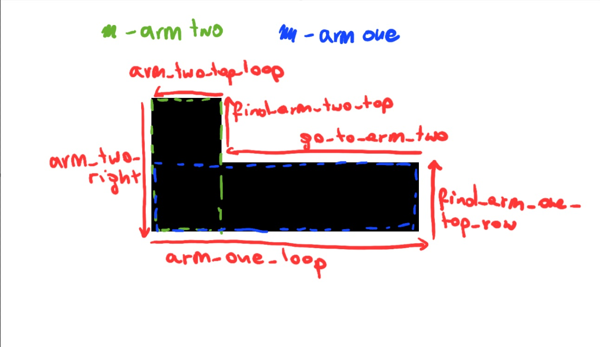

# Projekt x86 - zadanie 6.22

## Wykrywany znacznik - 7


## Testy

- [256bit.bmp](./tests/256bit.bmp) - zły format bitmapy
- [source.bmp](source.bmp) - jeden znacznik
- [349x178.bmp](./tests/349x178.bmp) - występuje padding
- [590x430.bmp](./tests/590x430.bmp) - drugi test gdzie jest padding
- [592x430.bmp](./tests/592x430.bmp) - rozmiar inny niż 320px x 240px bez paddingu
- [bad_ratio.bmp](./tests/bad_ratio.bmp) - znaczniki ze złymi proporcjami
- [bad_thick.bmp](./tests/bad_thick.bmp) - znaczniki z różnymi grubościami ramion
- [big_marker_holes.bmp](./tests/big_marker_holes.bmp) - znacznik nie wypełniony w środku
- [big_marker.bmp](./tests/big_marker.bmp) - pojedynczy duży znacznik
- [black.bmp](./tests/black.bmp) - wszystkie piksele czarne
- [borders_holes.bmp](./tests/borders_holes.bmp) - znaczniki przy dolnej i górnej granicy mapy z dziurami
- [borders.bmp](./tests/borders.bmp) - znaczniki przy dolnej i górnej granicy mapy
- [borders2.bmp](./tests/borders2.bmp) - znaczniki prz lewej i prawej granicy mapy
- [border3.bmp](./tests/borders3.bmp) - to samo co `borders2.bmp` tylko inny rozmiar mapy (321 x 240)
- [bumps.bmp](./tests/bumps.bmp) - znaczniki które mają nierówne krawędzie ramion
- [corners.bmp](./tests/corners.bmp) - znaczniki w rogach mapy
- [example_markers.bmp](./tests/example_markers.bmp) - przykładowy plik z treści zadania
- [mix.bmp](./tests/mix.bmp) - mix różnych znaczników
- [noise.bmp](./tests/noise.bmp) - tło w różnych kolorach
- [only7.bmp](./tests/only7.bmp) - same znaczniki nr 7
- [single_arms.bmp](./tests/single_arms.bmp) - pojedyncze ramiona
- [test.jpg](./tests/test.jpg) - złe rozszerzenie pliku
- [white.bmp](./tests/white.bmp) - cała mapa biała

## Budowanie programu
Za pierwszym razem `make` nie znajduje `main.o`. Po wpisaniu ponownie `make` program się buduje
```
>make                                                                           
nasm -o find_markers.o -f elf -g -l find_markers.lst find_markers.asm
g++ -m32 -c -g -O0 main.cpp -o main.o &> errors.txt
g++ -m32 -g -o find_markers main.o find_markers.o 
/usr/bin/ld: cannot find main.o: No such file or directory
collect2: error: ld returned 1 exit status
make: *** [makefile:13: link] Error 1
>make
nasm -o find_markers.o -f elf -g -l find_markers.lst find_markers.asm
g++ -m32 -c -g -O0 main.cpp -o main.o &> errors.txt
g++ -m32 -g -o find_markers main.o find_markers.o
```

## Uproszczony schemat działania `find_markers`
